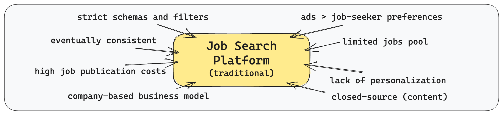
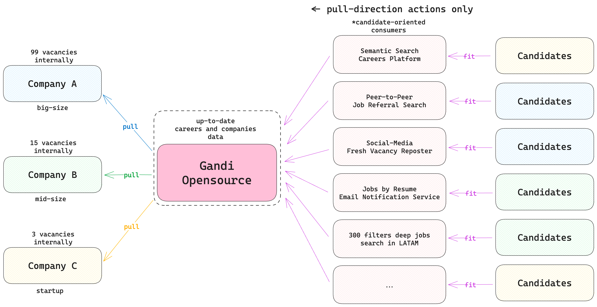
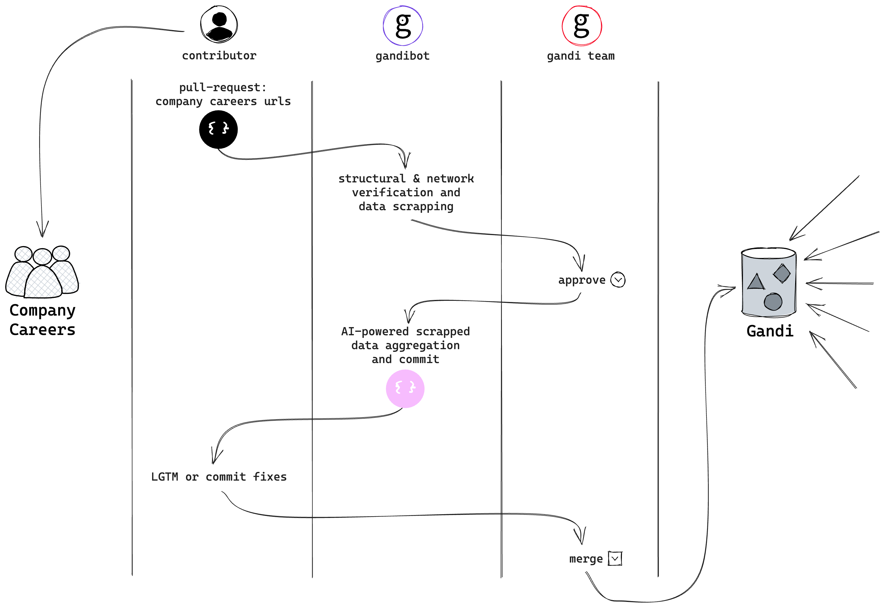

# Gandi ·   

> Stateful Reverse Proxy for decentralized IT jobs

Gandi shifts the closed-platform job search paradigm to a distributed, transparent and job-seeker driven model,
developing
capabilities to create unique job search engines that **share the same source of content** but provide **different
features** to retrieve and process it.

To put it simply, Gandi can be described as a company's job listings repository , which follows the following main
principles:

- **Decentralized** – each company is responsible for its own job listings, that have been published on the company's ATS or any other custom
  website and pulled by Gandi;
- **Instant** – a single link to a company's job listing ensures seamless sync with Gandi repository, negating the need
  for manual content duplication;
- **Open-source** – all job listings are stored publicly and can be used by anyone for any purpose;
- **Consistent** – all job listings are synced with the company's website on a daily basis.

## Why?

Traditional job search tools tend to position themselves as intermediaries, but their approach often fragments the job
market. Different job platforms publish unique sets of job listings, resulting in scattered and sometimes outdated
information. This fragmented reality can mislead job-seekers and burden companies that struggle to keep listings up to
date across multiple platforms.

Job search platforms operate more like a _black box_ than a practical tool. Companies face competition, huge costs for
posting and advertising, and restrictions on how much information they can communicate about their vacancy.

Similarly, job-seekers struggle with _rigid search_ and filter options. Each platform restricts users to its pre-defined
categories and keywords, leaving little room for a customised job search experience. In essence, these issues make job
searching a daunting task rather than a smooth process.

The job search industry is also prohibitively difficult to enter from a startup solutions perspective because **it's
rooted in the content problem**. We're sure there are a myriad of alternative approaches to filtering, sorting,
personalised search and alerts, but they're all prohibitively difficult to implement for one simple reason: **the lack
of an easy way to access corporate careers**.

### Does it have to be this way?

The unambiguous hiring goals of the company – to find the best-fit employee, and the job-seeker – to find the best-fit
job, pushed us to the alternative solution space:

1. Job postings should be **as public as possible** – so that as many job-seekers as possible can find them;
2. Job platform business model **shouldn't cut off needy companies that cannot afford it**;
3. The more **personalised job search** and filtering tools that exist, the more candidates will be able to find the
   right vacancies;
4. Innovative job search systems **should answer the "How"** and **take the "What" for granted** to cover as many
   job-seeker preferences as possible.

That's exactly what Gandi is trying to achieve.

## Approach

To make sure we're on the same page, let's see the Gandi's approach breakdown:

Gandi is deeply anchored around three main layers: pull-based careers retrieval engine, public careers storage, and
custom data consumer implementations – specific search platforms.

### Retrieval Engine

Gandi retrieves company job listings directly from the source. We ensure that the repository's data is directly fetched
from the companies’ websites, reducing the chance for outdated, misleading or fragmented job offers. This approach also
allows us to avoid the need for manual content duplication, as the **company's career page is the only source of truth**.

### Careers Storage

All gathered job listings are stored publicly and __can be accessed by everyone, at all times__, right in this
repository. By ensuring company job information is as public as possible, we feel this levels the playing field for all
job-seekers, and enables maximum reach.

### Data Consumers

That approach won't work without consumers – systems that are able to pull the data from Gandi, implement a custom
search engine based on that and fit the target audience – job-seeker needs.

It's crucial to understand that __Gandi is not a search engine itself__. We seek to
provide a data source for as many job search platforms as possible, and we're open to any company that wants to join us.

## How does it work?

The following visualisation should give you a better understanding:

Gandi relies on a simple seven-step process (2-steps from the contributor side):

1. Company's member creates a Pull Request with a __company's careers urls__, and some basic information about the
   company itself (if it's not already in the repository, one-time action). To make this process seamless, this
   repository is filled by helpful ./init script, template and example, that will create a contribution company folder
   for you;
2. Gandi Worker automatically prepares a __structural and network verification__ for a given job list, responding with a
   comment – within a few minutes;
3. If the verification is successful, Gandi Worker applies a "Verified" tag to the PR, and notifies a repository
   maintainer about the new content;
4. Maintainer reviews the PR, and approves it if everything looks good;
5. Gandi Worker pulls the vacancy content from the given url, and __prepares a commit__ with a new job listing
   aggregation data in a .json format to the same branch;
6. Contributor reviews the parsed job listings schema, commits remarks if anything missed, and approves the commit if
   everything looks good;
7. Maintainer merges the PR, and Gandi Worker automatically creates a new job listing files in 'data' folder, that can
   be finally used by consumers.

The sync process is even simpler and doesn't require any manual actions from the contributor side: there is a cron job
that runs every day, verifies the given job listing checksum by url, and creates an automatic PR if anything changed.

A practical example of the process sample can be found [right there](https://gandicore.com/playground).

To deep dive into the process, please refer to the [contribution](CONTRIBUTING.md)
and [company folder structure](/careers/README.md) documentations.

## Drawbacks and limitations

While we strive to create an alternative way for the job search process, we acknowledge the potential drawbacks of our
system:

- Companies that have no job listings on their website won't be able to use Gandi, as we don't provide any job
  listing creation tools. At least for now;
- Some companies might have restrictions on sharing their job adverts outside their platforms, leading to potential
  legal issues. Such remarks seem strange to us, and we keep blindly follow the assumption that it's in the company's
  interest to get as much vacancy distribution as possible, but in any case – we can get it. We left a company deletion
  request form in the issues template and promise to handle such cases ASAP;
- Gandi accepts English-language job listings only.

## Non-goals

We aim for ease of use, consistency and transparency, but there are certain areas Gandi explicitly does not target:

1. __To provide a strict copy of the company's original job listing__. Gandi consumers shouldn't act like a job
   application platforms, but rather as unique search engines. We completely accept aggregated information – a result of
   Gandi AI worker __and Contributor__ efforts – until that information is not violating the company's original job
   listing and easy to index dynamically.
2. Monetization of job posts – we don't earn profits from __the data we don't own__.
3. To compete with existing job search platforms. __Gandi is useless in a vacuum__. Our goal is simple – to provide
   information. And our information's goal is to be consumed by as many job search platforms as possible, nobody wins in
   the other case.

## Plans for the future
To be continued...

## Maintainer's final words
To be continued...
